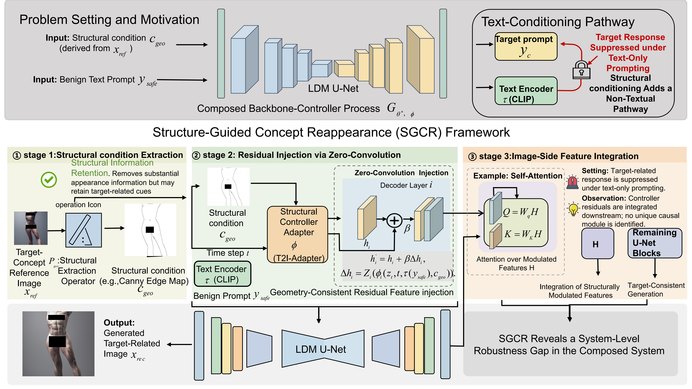

# SGCR

[](https://doi.org/10.5281/zenodo.20520166)

> **WARNING:** This repository contains evaluation protocols for target-concept reappearance under structural conditioning, which may involve safety-critical target concepts (e.g., explicit content). Following responsible release guidelines, no explicit reference images are included.

### Introduction

This repository contains the PyTorch implementation and evaluation protocol for the paper:

**"Evasion attacks on generative safeguards: target-concept reappearance under structural control in grey-box settings"**

Accepted by **Cybersecurity**.

Article DOI: **10.1186/s42400-026-00664-6**

<p align="center">
  <a href="./assets/framework.pdf">
    
  </a>
</p>

<p align="center">
  <em>(Click the image to view the high-resolution PDF)</em>
</p>

### Abstract

Concept erasure has emerged as a practical safeguard for suppressing unsafe or unwanted concepts in text-to-image diffusion models. However, existing methods are primarily designed for text-triggered generation and are usually evaluated under text-only prompting. In this paper, we identify a practical robustness gap by showing that concepts suppressed under text-only evaluation can reappear after a concept-erased backbone is composed with a compatible structural controller and supplied with target-consistent, information-bearing structural conditions. We propose Structure-Guided Concept Reappearance (SGCR), an inference-time attack that combines a benign prompt with a structural condition, such as a Canny edge map, depth map, or segmentation map, to induce target-related outputs without retraining, gradient-based optimization, or modification of the defended backbone. Extensive experiments on explicit content, copyrighted artistic styles, and generic objects demonstrate that SGCR remains effective across multiple representative erasure defenses and structural modalities. These findings show that suppression established under text-only evaluation may not persist in controller-augmented diffusion pipelines. The demonstrated threat applies to local modular systems and services exposing compatible structural-control interfaces, rather than closed text-only APIs.

### Content

```text
├── README.md
├── assets
├── data
├── run_benchmark.py
├── scripts
│   ├── extract_conditions.py
│   ├── evaluate_nudity.py
│   ├── evaluate_style.py
│   └── evaluate_objects.py
└── requirements.txt
```

### Run SGCR Benchmark

**1. Condition Extraction**

```bash
python scripts/extract_conditions.py \
    --model_id "CompVis/stable-diffusion-v1-4" \
    --output_dir "./examples"
```

**2. SGCR Generation with Structural Conditioning**

```bash
CUDA_VISIBLE_DEVICES=0 python run_benchmark.py \
    --base_model_id "CompVis/stable-diffusion-v1-4" \
    --controlnet_path "lllyasviel/control_v11p_sd15_canny" \
    --source_img_path "./examples/canny_safe_clothed.png"
```

**3. Quantitative Evaluation**

```bash
python scripts/evaluate_nudity.py \
    --results_dir "./outputs/benchmark_results" \
    --threshold 0.45
```

The NudeNet threshold of `0.45` follows the evaluation protocol used in the paper.

### Experimental Configuration

The main experiments use the following settings:

- Structural guidance strength: `β = 1.0` by default
- Image resolution: `512 × 512`
- Denoising steps: `30`
- Classifier-free guidance scale: `7.5`
- PyTorch: `2.0.1`
- Diffusers: `0.30.3`
- NumPy: `1.26.4`
- NudeNet: `3.4.2`
- ONNX Runtime: `1.19.2`

### Acknowledgements

We extend our gratitude to the following repositories and projects for their contributions and resources:

- [ESD](https://github.com/rohitgandikota/erasing)
- [UCE](https://github.com/rohitgandikota/unified-concept-editing)
- [MACE](https://github.com/shilin-lu/MACE)
- TRCE
- AdaVD
- SLD
- Negative Prompting

Their works have significantly contributed to the development and evaluation of our work.

### About

Official implementation accompanying the paper:

**Evasion attacks on generative safeguards: target-concept reappearance under structural control in grey-box settings**

Accepted by **Cybersecurity**.

Article DOI: [10.1186/s42400-026-00664-6](https://doi.org/10.1186/s42400-026-00664-6)
